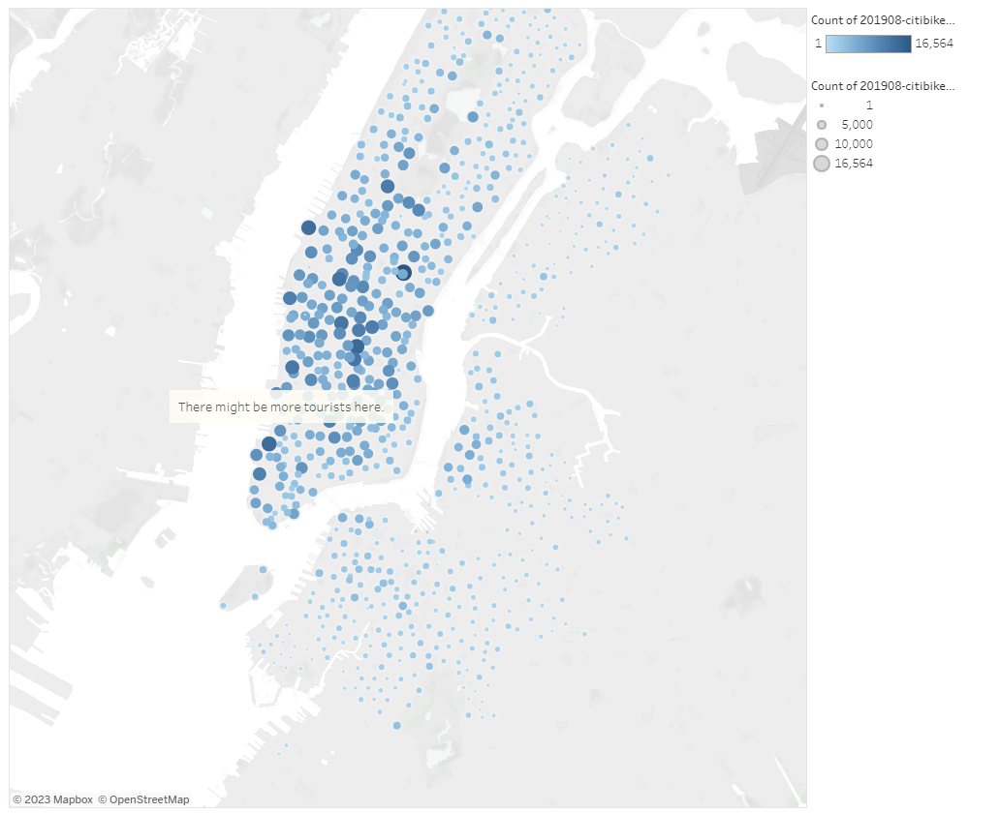
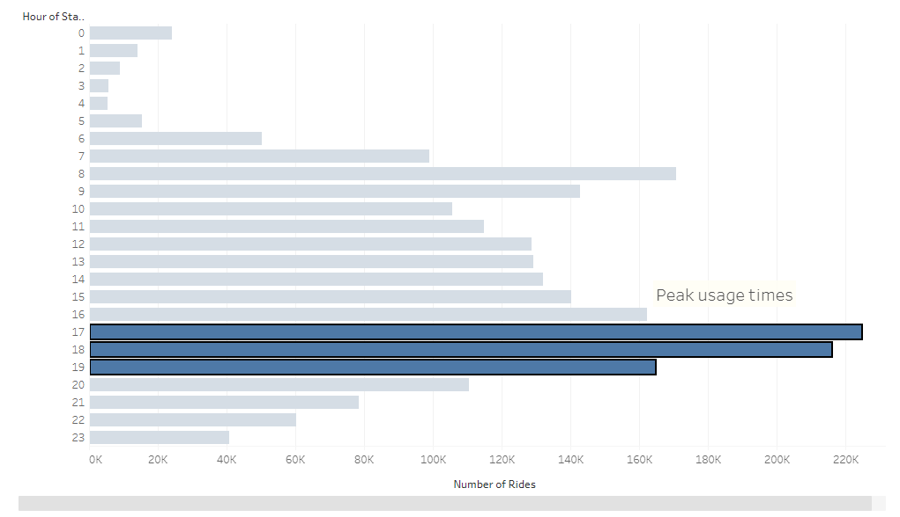
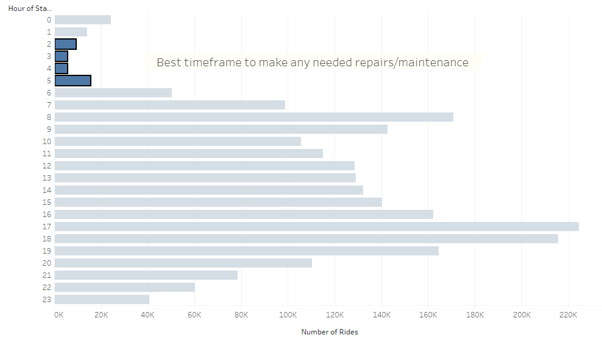
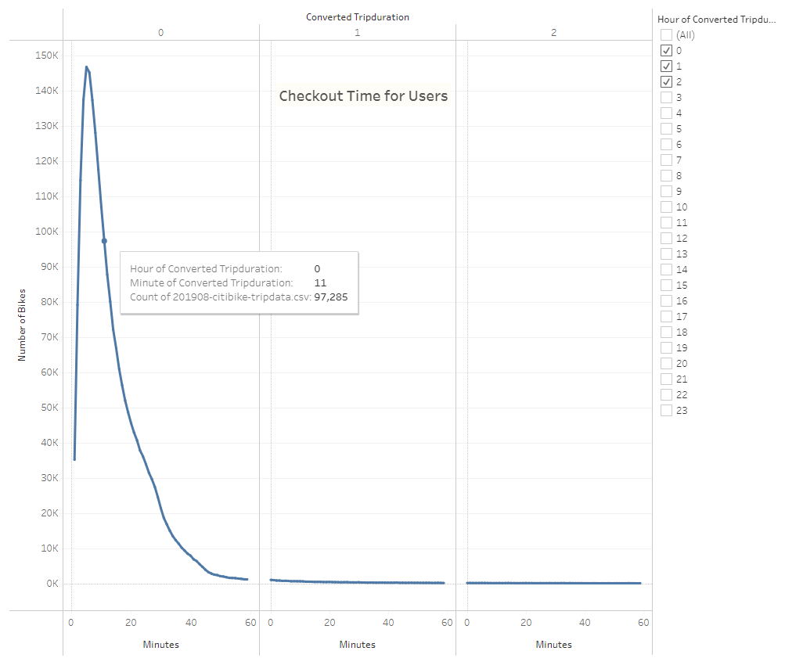
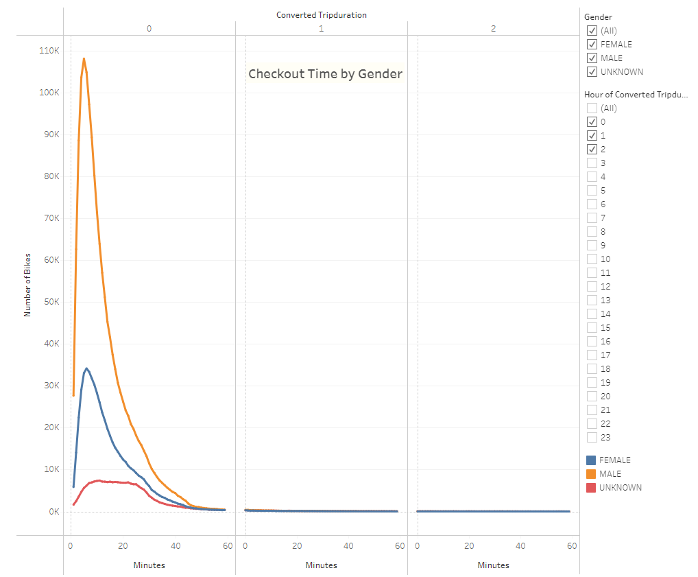
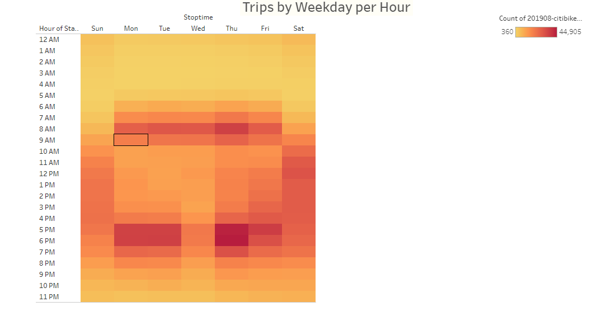
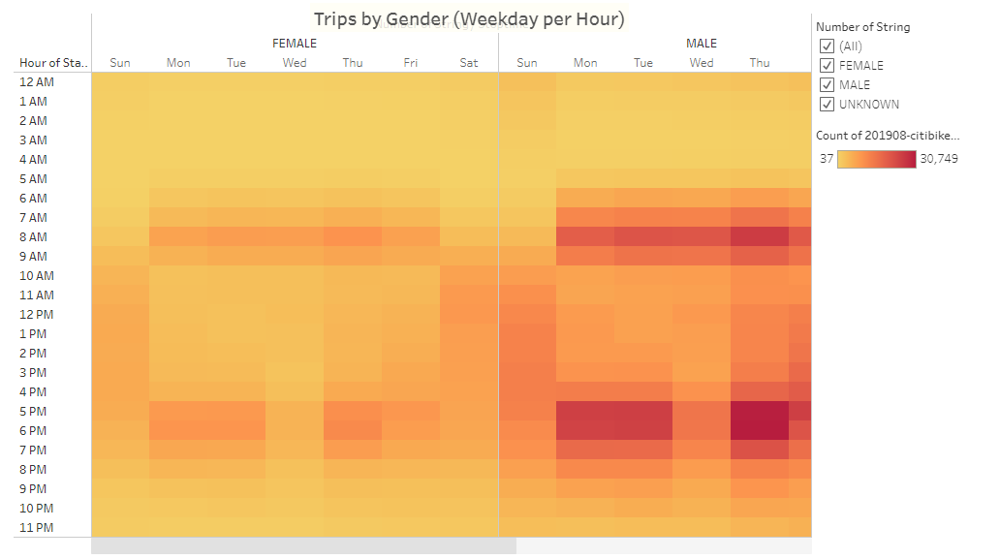
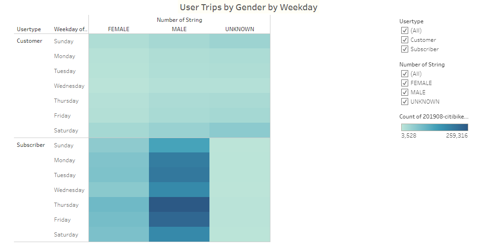

# bikesharing

### Project Overview
After going on vacation in New York City and using Citibikes (a bikesharing company), my friend Kate and I have come up with the idea to bring bikesharing to our hometown of Des Moines, Iowa. Kate has found an investor that might be interested in backing our project. It is up to me to deliver the analytics of the project based off of publicly available information from Citibike, to determine if a bikesharing business model is something that makes sense for our market.

### Resources
- Date Source: 201908-citibike-tripdata.csv (pulled from [Citi Bike NYC](https://citibikenyc.com/system-data))
- Software: Python 3.7.6, Jupyter Notebook, Pandas, Tableau Public, Atom 1.63.1, Visual Studio Code 1.74.1

### Results

[Link to Tableau Story](https://public.tableau.com/views/bikesharing_story_16795262474070/NYCStory?:language=en-US&publish=yes&:display_count=n&:origin=viz_share_link "Link to Dashboard")

***Figure 1***

>Figure 1: This image tells us the most popular start stations for Citi Bike rentals. This is heavily concentrated over Manhattan, a popular tourist destination which we can attribute to the popularity.

***Figure 2***

>Figure 2: This chart displays the peak hours of usage that the bikes are used the most are 5:00pm - 7:00pm, evening rush hour commute time. There is also a mini peak in usage around 8:00am-10am which is also around morning rush hour commute times. This indicates that the bikes are not being used by just tourists as theorized, but also by locals that may be trying to avoid vehicular gridlock.

***Figure 3***

>Figure 3: This chart displays the best time to perform repairs or scheduled maintenance is from 2:00am through 5:00am.

***Figure 4***

>Figure 4: This graph displays the number of bikes that are checked out by the length of use. It can be filtered by the hour of checkout time. As displayed, this graph shows the number of bikes that were checked out at 12:00am, 1:00am and 2:00am. There seems to be an influx of usage around Midnight users rent a bike for a quick 5 minute ride. The rest of the day has a consistent number of bike rentals with checkout times ranging from 1 minute to 59 minutes.

***Figure 5***

>Figure 5: This graph displays the number of bikes that are checked out by the length of use. It can be filtered by the hour of checkout time and by gender. As displayed, this graph shows the number of bikes that were checked out at 12:00am, 1:00am and 2:00am.

***Figure 6***

>Figure 6: This image is a heatmap that displays the number of trips for each hour for each day of the week. The darker the color, the more trips were taken during that hour on that day of the week. The most heavily used time is the 5:00pm and 6:00pm hours on Thursdays and again least usage is Monday through Friday 2:00am-5:00am.

***Figure 7***

>Figure 7: This image is a heatmap that displays the number of trips for each hour for each day of the week and sorted by gender. As displayed in this image you can see that females take less bike trips than males. Again, the darker the color, the more trips were taken during that hour on that day of the week. We know that Thursdays 5:00pm and 6:00pm is the most popular checkout time but from this image we can see that women only make up about 10,000 of these rentals the rest are male or unknown gender renters.

***Figure 8***

>Figure 8: This image is a heatmap that displays the number of trips by customer status (subscription member or guest) for each day of the week and sorted by gender. As displayed in this image you can see that guest use is not as popular as subscription use.

### Summary

In conclusion we know that bikesharing is very successful in New York City. This could be due to tourism, however from the analysis we can also see that local usage contributes largely. We can infer this in a couple of ways. First, by looking at subscriber versus guest information on the reservations. Second, by looking at the days of the week where there are the most trips taken. Lastly, by the peak hours of usage. With Citi Bike only being available at this time in New York City, the likelihood of non-local subscribers is very low. With subscriber usage making up the vast majority of rentals, this tells us that most of the users will be local, followed by tourists. The most used days of the week are Monday through Friday during the 5:00 a 6:00 evening rush hours, followed by 7:00-9:00 morning rush hour.

Other analysis that can be performed:
- Let's look at the end station locations per trip. This will help to tell us where the popular drop-off points are. Are they in neighborhoods or closer to hotels?
- I would also like to take a look at the average age of users. This information will help me decide if we have the correct demographic living in Des Moines to bring a bikesharing program to our city.
